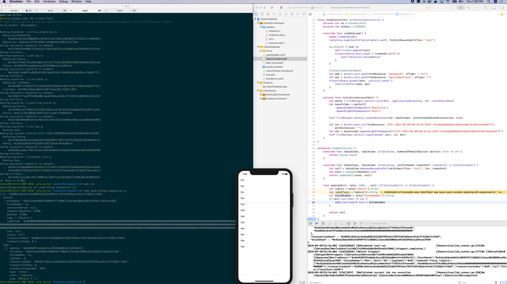

## Running [Chainlink](https://github.com/smartcontractkit/chainlink) on iOS

- Uses [gomobile](https://godoc.org/golang.org/x/mobile/cmd/gomobile)
- Runs the [echo server example](https://github.com/dimroc/chainlink/tree/master/examples/echo_server) with the echo server being the phone, everything else (devnet) remains the same and connects over localhost.
